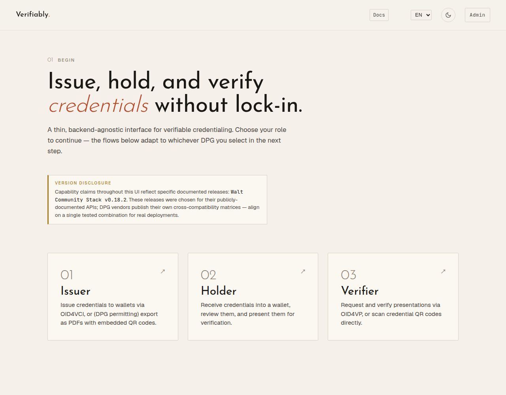
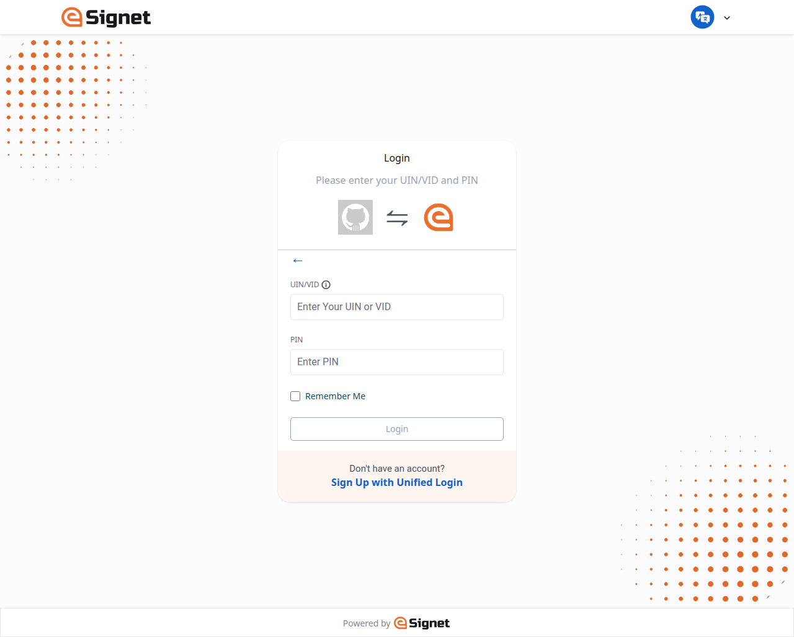
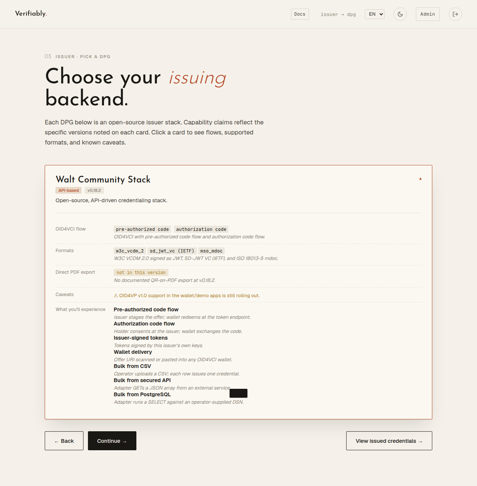
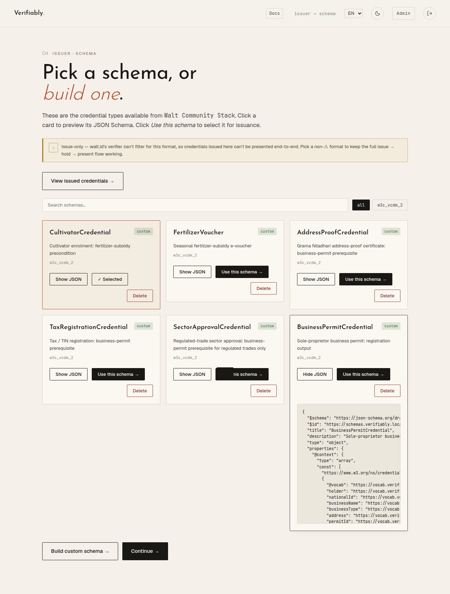
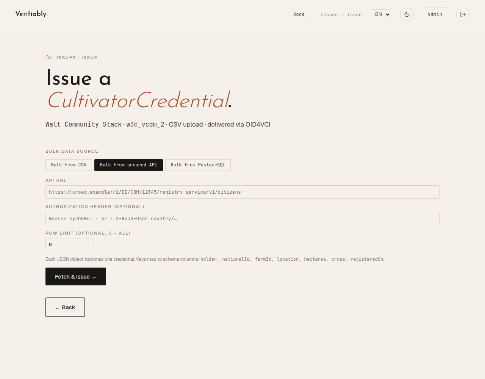
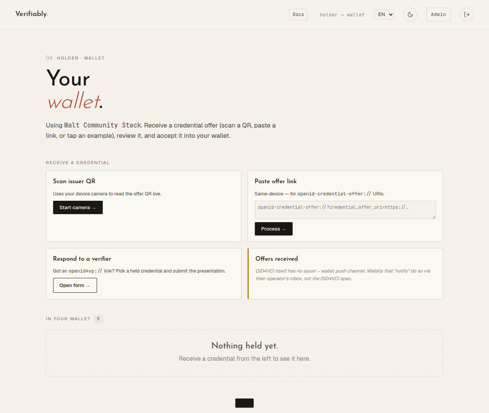
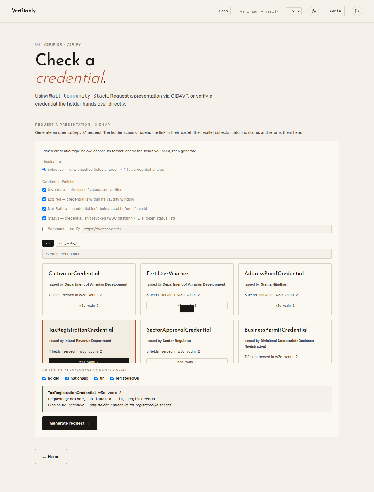
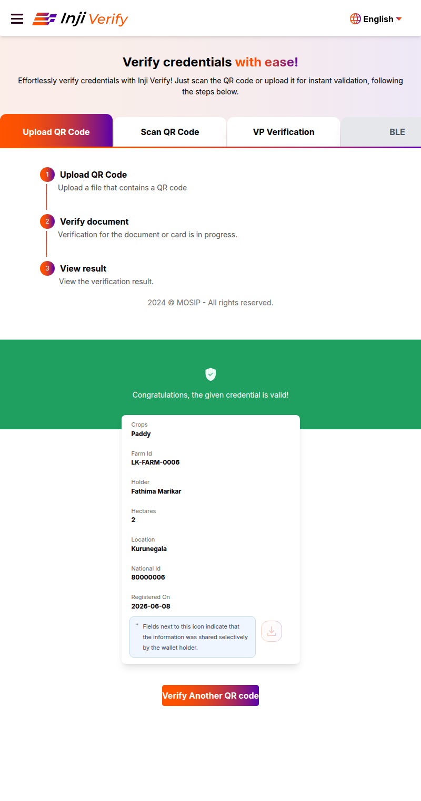
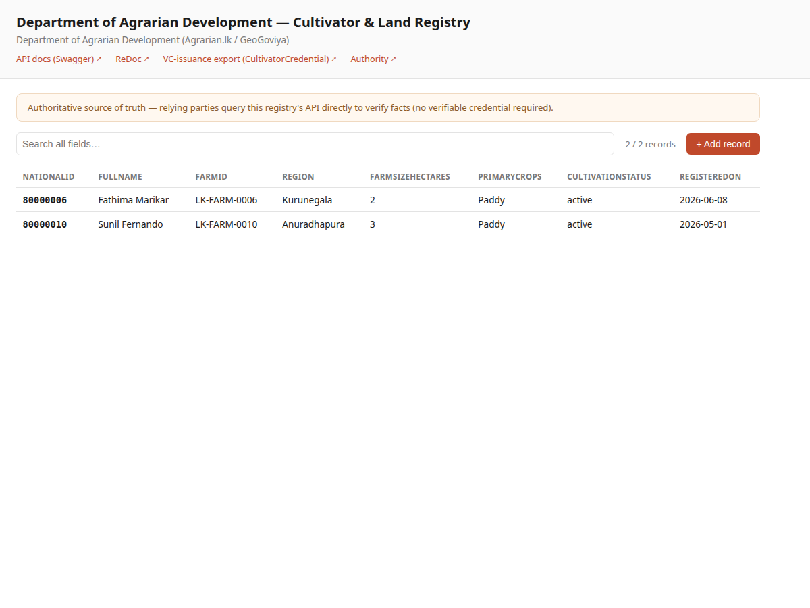
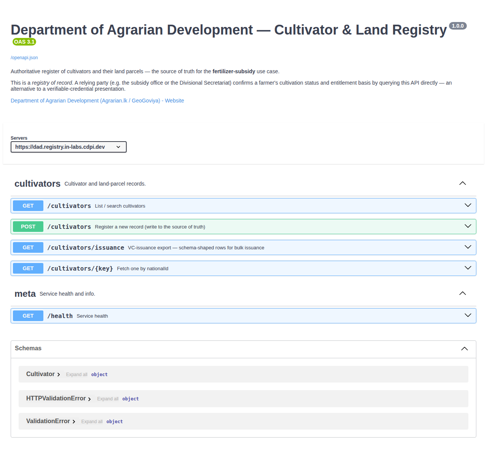

# User Journeys — SAR Workshop PoC

End-to-end flows for the two MVP public-service journeys in *SAR Workshop PoC*:

1. **Fertilizer subsidy (Yala)** — enrolment + seasonal claim
2. **Sole-proprietor business permit** — enrolment + registration

Both run on the same five open-source components and the same credential
lifecycle: **authenticate the person → check the authoritative record → issue a
portable credential → hold it → verify it on presentation.** Issuance is
consolidated on walt.id; Sunbird RC is the register of record only.

---

## Operational runbook — live hosts & click-paths

Everything is on public HTTPS. The internal service ports named in the component
table below map to these hosts:

| Host | What it is | Who uses it |
|---|---|---|
| **`vc.in-labs.cdpi.dev`** | **verifiably** — Issuer / Holder / Verifier, backed by walt.id | officer, citizen, relying party |
| `signup.in-labs.cdpi.dev` | self-registration (email-OTP) → creates a Sunbird `Person` | citizen |
| `sunbird-rc.in-labs.cdpi.dev/admin/` | registry admin portal — Person register + Sunbird-native issuance (PDF + QR) | officer |
| `inji-verify.in-labs.cdpi.dev` | Inji Verify — scan/upload a QR to verify | relying party |
| `esignet.in-labs.cdpi.dev` | eSignet OIDC — National ID + PIN (the login tile) | citizen |

Backend-only (not visited directly): `walt-issuer`, `walt-verifier`, `keycloak`,
`wso2` `.in-labs.cdpi.dev`. **Browser tip:** one login at a time; use a fresh
Incognito window per person (stale half-finished logins cause "Auth state mismatch").

### Three reusable steps

All three roles are at **`vc.in-labs.cdpi.dev`**. Pick a role, then sign in via the
**eSignet** tile (National ID `80000006` / PIN `100005`).

| Landing — pick a role | Sign in — pick an IdP | eSignet — National ID + PIN |
|---|---|---|
|  |  |  |

**ISSUE** → *Issuer* → DPG **Walt Community Stack** → pick the schema → fill fields
(manual, or a bulk source) → **Issue** → OID4VCI offer (QR + link).

| Pick a DPG | Pick a schema | Issue (bulk from a registry API) |
|---|---|---|
|  |  |  |

**HOLD** → *Holder* → wallet **API-based** → paste/scan the offer → credential lands.



**VERIFY** → *Verifier* → *Request a presentation · OID4VP* → pick type + tick
fields + keep policies on → **Generate** → open the `openid4vp://…` link in the
Holder wallet → **✓ Credential valid**.



The full stepwise flows (mapped to the docx) are in the two use-case sections below.

### Self-registration (citizen onboarding)

A citizen puts themselves on the register with an email code at
`signup.in-labs.cdpi.dev` (writes a Sunbird `Person`, then usable for eSignet login).


### Alternative track — registry-of-record + Inji Verify (Sunbird-native)

Issue a PDF + QR from `sunbird-rc.in-labs.cdpi.dev/admin/` → **Credentials**, then
verify by uploading the QR at `inji-verify.in-labs.cdpi.dev`, or have an agency
trust it by API (`/credentials/{id}/verify`). Use this for the "scan a paper QR" /
"registry-as-record" story; the walt.id path above is the wallet OID4VCI/OID4VP story.



The detailed design (actors, components, sample schemas, bulk path) follows.

---

## The five MVP components (as deployed)

| Lifecycle step | Component | In this deployment |
|----------------|-----------|--------------------|
| **Authenticate** | **eSignet** | `:3005` (OIDC UI) → eSignet `:8088`. Authenticates a citizen by **National ID + PIN** against the register, via the Authenticator plugin (mock-identity forked to read Sunbird `V_Person`). The live population register is mocked, per the MVP. |
| **Check record** | **Sunbird RC** | Registry of record (`V_Person`), `:18091`. Read interactively, or in bulk through verifiably's **DB source** (Model A — see `model-a-sunbird-db-source/`). |
| **Issue** | **walt.id** (via **verifiably**) | OID4VCI **pre-authorized-code**, W3C VCDM / SD-JWT VC. verifiably orchestrates; walt.id signs. UI at `:8080`. |
| **Hold** | **Credo wallet** (cdpi-wallet) / **Inji Web** | Receives the OID4VCI offer and stores the credential. (Credo holder not yet wired; Inji Web wallet is available in-stack.) |
| **Verify** | **walt.id verifier** (via verifiably) | OID4VP presentation, or direct scan/upload/paste. Checks signature, expiry, status-list revocation. |

**Standing choices** (keep the five interoperable): one pinned OID4VCI/OID4VP
version + **HAIP** (SD-JWT VC, ES256); mocked identity source; **single issuer**
(walt.id) with Sunbird registry-only.

**What stays physical** (digitised only as a record + credential): the **land
inspection** that establishes cultivation rights, and the **Grama Niladhari
address verification**.

**Two ways to issue** — both go through the same walt.id issuer:
- **Interactive / single** — one citizen at a time, authenticated via eSignet
  (the journeys below are written this way).
- **Bulk / back-office** — a ministry officer issues to many eligible citizens at
  once by reading the register through verifiably's **DB source**
  (`SELECT … FROM vc_* views`). Same credential, same issuer; eligibility is the
  query's `WHERE` clause. Applies to the **ISSUE** steps in the flows below — see
  *Where the DB-source bulk path fits*.

Sample test identity (seeded): National ID `80000006`, PIN `100005`
(`isCultivator = true`, `farmId = KE-FARM-0006`).

---

# How the docx flows map to this deployment

Three substitutions from the reference architecture, named once here, then assumed:
- **Wallet** — the docx names **Credo**; this deployment uses the **walt.id wallet**
  via verifiably's **Holder** role (Credo isn't deployed). "Accept into the wallet" = HOLD.
- **Attestation workflow & eligibility/validity rules** — in the MVP these are
  **officer actions in the Sunbird admin portal**, not an automated engine.
- **Business-permit prerequisites** — the docx lists GN certificate + notary
  deed/lease + sector approval. Built schemas cover the GN certificate
  (`AddressProofCredential`), sector approval (`SectorApprovalCredential`) and permit
  (`BusinessPermitCredential`); `TaxRegistrationCredential` stands in for the
  deed/lease until a `DeedOrLease` schema is added.

Each step's **how-to** (the exact clicks) is the ISSUE / HOLD / VERIFY procedure in
the runbook above. Host shorthand — **vc** = `vc.in-labs.cdpi.dev`, **sunbird** =
`sunbird-rc.in-labs.cdpi.dev/admin/` (identity / Person register), **signup** =
`signup.in-labs.cdpi.dev`; and the **federated agency registries** (each a source
of truth with its own OpenAPI at `/docs`): **dad** = `dad.registry.in-labs.cdpi.dev`
(cultivator/land), **gn** = `grama-niladhari.registry.in-labs.cdpi.dev` (address
attestation), **biz** = `business.registry.in-labs.cdpi.dev` (business-name register).

**Two ways to exchange trusted data** — every "check the record" step below can be
done as a **direct API call to the owning registry** (registry-as-record, *no VC* —
e.g. `GET dad.registry…/cultivators/80000006`) **or** as a **VC presentation**
(OID4VP at **vc** → *Verifier*). The flows name both.

---

# Use case 1 — Fertilizer subsidy (Yala)

Paddy farmers, each Yala season; the entitlement is delivered as an **e-voucher
credential** (no payment leg). Two flows: a one-time **enrolment** →
`CultivatorCredential`, and a per-season **claim** → `FertilizerVoucher`.

## Flow A · Enrolment (first-time farmer or tenant)
*The physical land inspection that establishes cultivation rights is retained; only the recording and the credential are digitised.*

| # | Step (docx) | DPG · interface | Host endpoint · what to do |
|---|-------------|-----------------|----------------------------|
| 1 | Farmer authenticates with the National ID Card | **eSignet** · OAuth2/OIDC | **vc** → sign in via the **eSignet** tile (NID `80000006` / PIN `100005`) |
| 2 | Land inspection & rights check (physical) recorded as an attestation | **DAD registry** (Agrarian) | **dad** → record the cultivation-rights attestation on the farmer's record |
| 3 | Cultivator entry written to the land register (`farmId`, `farmSizeHectares`, `primaryCrops`, `region`, `cultivationStatus`) | **DAD registry** (Agrarian) | **dad** → `POST /cultivators` (the identity Person stays at **sunbird** / **signup**) |
| 4 | `CultivatorCredential` issued (OID4VCI) and accepted into the wallet | **walt.id issuer → wallet** | **ISSUE** at **vc** → *Issuer*; **HOLD** at **vc** → *Holder* |

**Outcome:** the farmer is on the register as a cultivator and holds the
`CultivatorCredential` — the precondition for every claim.

## Flow B · Seasonal claim (once per Yala, already-enrolled farmer)

| # | Step (docx) | DPG · interface | Host endpoint · what to do |
|---|-------------|-----------------|----------------------------|
| 1 | Farmer authenticates with the National ID Card | **eSignet** · OAuth2/OIDC | **vc** → **eSignet** tile |
| 2 | Cultivator & land record verified — incl. active cultivation this season | **DAD registry** *or* **walt.id verifier** | API: `GET dad…/cultivators/{nationalId}`; **or** VC: **VERIFY** the `CultivatorCredential` at **vc** → *Verifier* |
| 3 | Eligibility & entitlement checked — paddy crop, active cultivation, per-farmer hectare cap; amount by land area | **rules check on the DAD registry** (officer, MVP) | **dad** — read `cultivationStatus` / `farmSizeHectares`; `entitlementKg` derived from hectares |
| 4 | `FertilizerVoucher` e-voucher issued (OID4VCI pre-auth) and accepted | **walt.id issuer → wallet** | **ISSUE** at **vc** → *Issuer*; **HOLD** → *Holder* |
| 5 | Voucher presented & verified at the Agrarian Service Centre on redemption | **walt.id verifier** · OID4VP | **VERIFY** at **vc** → *Verifier* (depot checks signature, validity, status) |

**Outcome:** the farmer redeems a verifiable e-voucher for the season's fertilizer
— no cash transfer, same issuer and wallet.

---

# Use case 2 — Sole-proprietor business permit

Registers a sole proprietorship; no payments / G2P. Two flows: **enrolment** that
gathers the prerequisite credentials, and **registration** that validates and records
them. The Grama Niladhari address verification stays physical; only the certificate
becomes a credential.

## Flow A · Enrolment (assemble prerequisite credentials)
*Each supporting document becomes a wallet credential; a regulated trade adds a sector approval.*

| # | Step (docx) | DPG · interface | Host endpoint · what to do |
|---|-------------|-----------------|----------------------------|
| 1 | Applicant authenticates with the National ID Card | **eSignet** · OAuth2/OIDC | **vc** → **eSignet** tile |
| 2 | Grama Niladhari address verification (physical) recorded, then certificate issued as a credential & accepted | **GN registry** → **walt.id issuer → wallet** | record at **gn** (`POST /attestations`); then **ISSUE** `AddressProofCredential` at **vc** → *Issuer*; **HOLD** → *Holder* |
| 3 | Notary-certified deed or lease issued as a credential (proof of business address) & accepted | **walt.id issuer → wallet** | **ISSUE** the deed/lease credential † at **vc** → *Issuer*; **HOLD** → *Holder* |
| 4 | Sector approval issued as a credential — if the trade is regulated — & accepted | **walt.id issuer → wallet** | **ISSUE** `SectorApprovalCredential` at **vc** → *Issuer*; **HOLD** → *Holder* |

† stand-in: the built set uses `TaxRegistrationCredential`; add a `DeedOrLease` schema to match the docx exactly.

**Outcome:** the proprietor's wallet holds the assembled prerequisite credentials.

## Flow B · Registration (validate + record + issue the permit)

| # | Step (docx) | DPG · interface | Host endpoint · what to do |
|---|-------------|-----------------|----------------------------|
| 1 | Applicant authenticates with the National ID Card | **eSignet** · OAuth2/OIDC | **vc** → **eSignet** tile |
| 2 | Business-name uniqueness checked | **Business registry** (Divisional Secretariat) | **biz** — `GET /businesses?q=<name>` (no match = available) |
| 3 | Application validity checked — required credentials present & valid (GN certificate, deed, affidavit; sector approval if regulated) | **completeness check** (officer, MVP) | confirm the applicant holds the prerequisites from Flow A |
| 4 | Credentials presented to the Divisional Secretary & verified | **walt.id verifier** · OID4VP | **VERIFY** at **vc** → *Verifier* — request a presentation; applicant presents from the *Holder* wallet |
| 5 | `BusinessPermitCredential` issued and the register updated | **walt.id issuer + Business registry** | **ISSUE** at **vc** → *Issuer*; **HOLD** → *Holder*; record the business at **biz** (`POST /businesses`) |

**Outcome:** the business is on the register and the proprietor holds a verifiable
permit, presentable to banks, suppliers, and authorities.

---

## Federated registries — sources of truth + per-registry OpenAPI

Each authority runs its **own** registry (a standalone service, its own store, a
browseable **admin UI at the host root**, and OpenAPI/Swagger at `/docs`). This is
the **data-exchange-without-VCs** path: a relying party confirms a fact by querying
the owning registry directly — an alternative to an OID4VP presentation. (DNS:
wildcard `*.registry.in-labs.cdpi.dev`.)

| Registry host | Authority | Holds | UI / docs | Example no-VC call |
|---|---|---|---|---|
| `dad.registry…` | Dept of Agrarian Development | cultivator / land records | `/` admin · `/docs` | `GET /cultivators/80000006` → cultivation status |
| `grama-niladhari.registry…` | e-Grama Niladhari | address attestations | `/` admin · `/docs` | `GET /attestations/80000001` → verified address |
| `business.registry…` | Divisional Secretariat | business-name register | `/` admin · `/docs` | `GET /businesses?q=<name>` (uniqueness) · `GET /businesses/BP-80000001` (permit) |

Each exposes a record table + live search + add-record form at the **host root**
(like `sunbird-rc…/admin/`), plus the API: `GET /<entity>` (list + `?q=` search),
`GET /<entity>/{key}` (authoritative lookup), `POST /<entity>` (write),
`GET /<entity>/issuance` (schema-shaped rows for bulk issuance — see *Bulk
issuance*), `GET /health`, `/docs` (Swagger), `/redoc`. Identity stays with eSignet /
the National ID anchor; these registries hold the agency-specific facts the
journeys check. Code: `infra/registries/`.

| Admin UI (host root) — browse / search / add | OpenAPI (Swagger) at `/docs` |
|---|---|
|  |  |

---

## Sample custom schemas (build these once in verifiably)

These are the credential schemas the journeys above issue. walt.id's stock
catalog has no "cultivator / voucher / permit" types, so each is a **custom
schema** — build it once in **Issuer → Schema → Build** (or seed
`config/custom-schemas.user.json`), then the bulk **Database** source / single
issuance can target it.

Conventions, grounded in the deployed builder:
- **Std (interop profile).** The doc's standing choice is **HAIP — SD-JWT VC with
  ES256**, i.e. `Std: "sd_jwt_vc"`. The box's proven walt.id path today is
  `Std: "w3c_vcdm_2"` (W3C VCDM 2.0, `jwt_vc_json`, via the adapter's borrow);
  swap to `sd_jwt_vc` for HAIP conformance once the catalog entry is in place.
- **Field names are case-sensitive and MUST equal the DB-source view columns**
  (`model-a-sunbird-db-source/sql/init-views.sql`) — `bulk.go` keys each row by
  column name, so a mismatch silently drops the field.
- **Datatypes** the builder offers: `string`, `number`, `integer`, `boolean`,
  `date` (= `string`+`format:date`), `uri`. *Caveat:* the DB bulk source coerces
  every value to a string, so numeric/date types are advisory there — use the
  manual or API/JSON source if you need strict typing in the VC.
- The **Source** column shows where each value comes from: a `V_Person` register
  column (so it flows through the bulk path), a presented credential, or a
  physical/derived step.

### 1.1 `CultivatorCredential` — Fertilizer subsidy · enrolment
Issuer attribution: *Department of Agrarian Development*. View: `vc_fertilizer_cultivator`.

| Field | Type | Req | Source |
|-------|------|-----|--------|
| `holder` | string | ✓ | `V_Person.fullName` |
| `nationalId` | string | ✓ | `V_Person.nationalId` |
| `farmId` | string | ✓ | `V_Person.farmId` |
| `location` | string |  | `V_Person.region` |
| `hectares` | number |  | `V_Person.farmSizeHectares` |
| `crops` | string |  | `V_Person.primaryCrops` |
| `registeredOn` | date | ✓ | enrolment date |

### 1.2 `FertilizerVoucher` — Fertilizer subsidy · seasonal claim
Issuer attribution: *Department of Agrarian Development*. View: `vc_fertilizer_voucher`.

| Field | Type | Req | Source |
|-------|------|-----|--------|
| `holder` | string | ✓ | `V_Person.fullName` |
| `nationalId` | string | ✓ | `V_Person.nationalId` |
| `farmId` | string | ✓ | `V_Person.farmId` |
| `season` | string | ✓ | `"Yala 2026"` |
| `crop` | string |  | `V_Person.primaryCrops` (first) |
| `entitlementKg` | integer | ✓ | derived (`hectares × 50`; real: allocation table) |
| `voucherId` | string | ✓ | derived (`YALA2026-<nationalId>`) |
| `validUntil` | date | ✓ | season end |

### 2.1 Prerequisite credentials — Business permit · enrolment
The enrolment flow assembles these into the wallet first; the registration flow
verifies them (OID4VP). Each is its own custom schema, issued by its authority.
These are *presented*, not read from `V_Person`, so they're single-issuance
(not bulk DB-source) credentials.

**`AddressProofCredential`** — issuer *Grama Niladhari* (the GN certificate; the
in-person address check stays physical):

| Field | Type | Req | Source |
|-------|------|-----|--------|
| `holder` | string | ✓ | applicant name |
| `nationalId` | string | ✓ | National ID |
| `address` | string | ✓ | verified address |
| `gnDivision` | string | ✓ | GN division |
| `verifiedOn` | date | ✓ | inspection date |

**`TaxRegistrationCredential`** — issuer *Inland Revenue Department*:

| Field | Type | Req | Source |
|-------|------|-----|--------|
| `holder` | string | ✓ | taxpayer name |
| `nationalId` | string | ✓ | National ID |
| `tin` | string | ✓ | tax identification number |
| `registeredOn` | date | ✓ | TIN issue date |

**`SectorApprovalCredential`** — issuer *sector regulator* (only for a **regulated
trade**, e.g. food, pharma, transport):

| Field | Type | Req | Source |
|-------|------|-----|--------|
| `holder` | string | ✓ | applicant name |
| `nationalId` | string | ✓ | National ID |
| `sector` | string | ✓ | regulated sector |
| `approvalRef` | string | ✓ | approval reference |
| `validUntil` | date | ✓ | approval expiry |

> Identity itself is **not** a custom schema here — it is asserted at runtime by
> **eSignet** (National ID + PIN) at the top of each flow, per the MVP's "mocked
> identity source" choice, so the credentials above bind to an already-verified
> citizen rather than re-attesting identity.

### 2.2 `BusinessPermitCredential` — Business permit · registration
Issuer attribution: *Divisional Secretariat (Business Registration)*. View: `vc_business_permit`.

| Field | Type | Req | Source |
|-------|------|-----|--------|
| `holder` | string | ✓ | `V_Person.fullName` (proprietor) |
| `nationalId` | string | ✓ | `V_Person.nationalId` |
| `businessName` | string | ✓ | business register |
| `businessType` | string | ✓ | `"Sole Proprietorship"` |
| `address` | string | ✓ | register / GN certificate |
| `permitId` | string | ✓ | derived (`BP-<nationalId>`) |
| `issuedOn` | date | ✓ | registration date |

### Persisted shape (one full example)
`Issuer → Schema → Build` writes entries like this to
`config/custom-schemas.user.json` (`ID` is auto-assigned `custom-<base36>`;
`Datatype:"string" + Format:"date"` is what the builder's **date** option emits):

```json
{
  "Name": "CultivatorCredential",
  "Std": "sd_jwt_vc",
  "Custom": true,
  "IssuerDisplayName": "Department of Agrarian Development",
  "AdditionalTypes": ["CultivatorCredential"],
  "FieldsSpec": [
    {"Name": "holder",       "Datatype": "string",  "Format": "",     "Required": true},
    {"Name": "nationalId",   "Datatype": "string",  "Format": "",     "Required": true},
    {"Name": "farmId",       "Datatype": "string",  "Format": "",     "Required": true},
    {"Name": "location",     "Datatype": "string",  "Format": "",     "Required": false},
    {"Name": "hectares",     "Datatype": "number",  "Format": "",     "Required": false},
    {"Name": "crops",        "Datatype": "string",  "Format": "",     "Required": false},
    {"Name": "registeredOn", "Datatype": "string",  "Format": "date", "Required": true}
  ]
}
```

---

## Bulk issuance — DB source or the agency registries

The journeys above are the **interactive, per-person** path (one credential at a
time). The **ISSUE** steps can also run as **back-office bulk** — verifiably reads
many rows from a source and fans out one credential per row through the same
walt.id issuer. Two sources:

**1 · DB source** (`model-a-sunbird-db-source/`): verifiably's **Database** bulk
source runs a `SELECT` against the Sunbird Postgres views (`vc_fertilizer_cultivator`,
`vc_fertilizer_voucher`, `vc_business_permit`); eligibility is the view's `WHERE`
clause. Proven end-to-end: register row → walt.id offer URI.

**2 · Agency registries (API source)**: verifiably's **API** bulk source GETs a
JSON array and maps each object's keys to the schema's fields **by name**. Each
registry therefore exposes a **VC-issuance export** — `GET /<entity>/issuance` —
that reshapes its records to the credential's exact field names (and filters to
the eligible rows, e.g. `cultivationStatus=active`). To bulk-issue:

> Issuer → pick the schema → **Bulk** → **API** source → `api_url` =
> `http://<svc>:8000/<entity>/issuance` (in-cluster URL; verifiably-go fetches it
> server-side over `waltid_default`) → Issue. One offer per row.

| Credential | Registry export (`api_url`) | Eligibility filter |
|---|---|---|
| `CultivatorCredential` | `http://dad-registry:8000/cultivators/issuance` | `cultivationStatus=active` |
| `AddressProofCredential` | `http://gn-registry:8000/attestations/issuance` | — |
| `BusinessPermitCredential` | `http://business-registry:8000/businesses/issuance` | `status=registered` |

Data contract **verified**: each `/issuance` export's keys equal the credential's
`FieldsSpec` exactly (no field dropped), and verifiably's `fetchJSONRows`
stringifies numeric values — so the by-name mapping is lossless. (The final
fan-out is the operator's bulk-issue action in the UI.)

## Maps to existing national systems

The MVP **fronts** systems Sri Lanka already operates (National ID, agrarian
register, GN address attestation, business registry) — it does not replace them.
eSignet wraps the existing identity backend; Sunbird RC mirrors the authoritative
records; walt.id adds the portable, verifiable credential layer on top.

> **Extension path (Section 2 of the doc, not in the MVP):** the fertilizer
> journey grows a payment leg (OpenG2P → Mifos Payment Hub EE → Mojaloop) to
> move from e-voucher to cash transfer; both journeys can add identity, credential
> lifecycle (revocation/renewal), offline presentation, consent, and verifier
> choice (CREDEBL) — each additive, attaching at seams the MVP already exposes.
